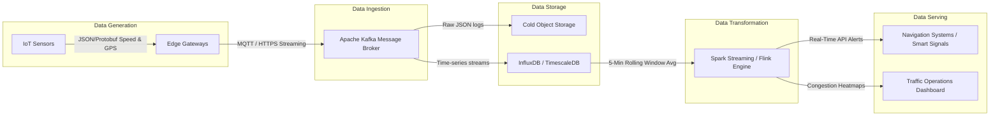

# Practical 1: Understanding the Data Engineering Lifecycle

## Subject
**ITUC301 - Data Engineering**

## Practical Title
Understanding the Data Engineering Lifecycle

## Objective
To study and understand the complete end-to-end Data Engineering Lifecycle of an enterprise e-commerce platform by designing an architectural data flow diagram illustrating data flow through data generation, ingestion, storage, transformation, and serving. The architecture also incorporates security, observability, and data privacy as cross-cutting concerns.

## Problem Definition
Study, dissect, and map the complete end-to-end data engineering lifecycle for an enterprise e-commerce platform. Students must trace data states across all five core lifecycle stages: data generation, ingestion, storage, transformation, and serving. The solution requires creating a detailed architectural data flow diagram along with a system manifesto documenting cross-cutting lifecycle undercurrents (security, observability, and data privacy). This initial structure must be committed to a personal Git repository.

## Dataset/Test Data
The practical assumes a mock enterprise e-commerce dataset containing:
* **Customers Table:** Transactional schema (CustomerID, Name, Email, Phone, CreatedAt).
* **Orders Table:** Transactional schema (OrderID, CustomerID, ProductID, Amount, OrderDate, Status).
* **Products Catalog Table:** Relational database (ProductID, Name, Category, Price, StockQuantity).
* **Clickstream JSON Payloads:** Semi-structured data representing user activity (SessionID, UserID, PageURL, EventType, Timestamp).
* **Inventory Logs:** Unstructured/semi-structured event logs tracking warehouse movements.

## Tools/Technology Used
* **Lucidchart / Draw.io** (For designing the architectural data flow diagram)
* **Git** (For local version control management)
* **GitHub** (For host repository management and code submission)

---

## Detailed Explanation of the Five Lifecycle Stages

### 1. Data Generation
Data Generation represents the initial stage where source systems create operational data. In our e-commerce environment, this includes relational database transactions (OLTP databases hosting Customer, Order, and Product tables), semi-structured JSON payloads representing client clickstream events (such as page views, cart additions, and searches), and unstructured inventory logs tracking item movements in warehouses. The primary challenge at this stage is managing the velocity of streaming clickstream data and ensuring that upstream generation changes do not corrupt downstream data pipelines.

### 2. Data Ingestion
Data Ingestion is the process of extracting data from source systems and transporting it to storage layers. Ingestion is split into two primary patterns: Batch Ingestion and Streaming Ingestion. Batch Ingestion is used for historical database dumps, product catalog updates, and transaction reconciliations, typically scheduled hourly or daily via CSVs or database copies. Streaming Ingestion is used for continuous, low-latency traffic such as clickstream event payloads and real-time stock status changes, using message brokers like Apache Kafka or AWS Kinesis to buffer and transport messages.

### 3. Data Storage
Data Storage involves saving the ingested raw data in a secure, scalable repository before processing. In modern architectures, storage is divided into multiple zones: a Raw Storage zone (Data Lake) where raw CSV files, clickstream JSON, and logs are landed in their native formats; a Processed Data zone where files are validated, cleaned, and stored in optimized column formats (like Parquet); and an Analytics Warehouse zone (Data Warehouse) housing structured relational tables ready for query execution. This data partitioning separates storage costs from computational processing requirements.

### 4. Data Transformation
Data Transformation is the process of converting raw, dirty data into structured, clean, and business-ready datasets. Typical operations include structural data cleaning (handling null values, standardizing date formats, validating schemas), data integration (joining transaction logs, product details, and customer profiles), and data aggregation (computing daily sales summaries, customer lifetime values, and website traffic patterns). These transformations are computed in memory using frameworks like Apache Spark or within the warehouse using SQL queries.

### 5. Data Serving
Data Serving is the final stage where clean, structured data is exposed to downstream consumers to drive business decisions. Serving interfaces include Business Intelligence (BI) dashboards (e.g., Tableau, Power BI) for executive reporting, structured SQL API endpoints for customer applications, and machine learning features for building recommendation engines and customer churn models. The serving layer must guarantee low-latency query results and enforce role-based access control to prevent data leaks.

---

## Architecture Diagram

The architectural diagram mapping out these five stages and the cross-cutting concerns (Security, Observability, and Data Privacy) is included below:

### Explanation of the Architecture Diagram
Figure 1 illustrates the enterprise e-commerce data engineering lifecycle.
1. **Data Generation:** Customer database, products, orders, clickstream JSON payloads, and inventory logs act as primary data generators.
2. **Data Ingestion:** Batch ingestion routes bulk databases and CSV files, while streaming ingestion captures real-time API clickstream events.
3. **Data Storage:** Data lands first in the raw zone of the Data Lake, flows through a structured processed zone, and is finally loaded into the Analytics Warehouse.
4. **Data Transformation:** Data processing engines remove null entries, validate schemas, join transactional sources with clickstream JSON, and compute aggregations.
5. **Data Serving:** The final data is served directly to reporting dashboards, operational analytics tools, and machine learning recommendation engines.
6. **Cross-Cutting Concerns:** Throughout all five stages, horizontal undercurrents (Security, Observability, and Data Privacy) are actively enforced to protect data flow, track pipeline health, and maintain privacy compliance.

---

## Key Questions / Analysis / Interpretation

### 1. How do the technical demands of downstream serving layers directly influence ingestion and storage design decisions during the early generation phases?
The technical requirements of the downstream serving layer (such as query latency, data freshness SLAs, and concurrency limits) dictate how the data must be ingested and stored. For example, if a serving system requires real-time dashboard updates (e.g., monitoring warehouse stock levels to prevent over-purchasing), the ingestion layer must use streaming technologies (e.g., Kafka) and the storage layer must support low-latency time-series writes. However, if the serving layer only requires daily summary reports, a batch ingestion model using cheap cold storage is preferred because it reduces compute costs and infrastructure complexity.

### 2. Differentiate between the broader data lifecycle and the technical data engineering lifecycle within an enterprise.
* **Broader Data Lifecycle:** Focuses on the business, legal, and operational lifecycle of data from its initial generation, active usage across departments, security auditing, archiving, and final deletion or purging. It centers on data governance, business value, policy enforcement, and compliance.
* **Technical Data Engineering Lifecycle:** Focuses specifically on the system-level details of data movement and transformation. It deals with pipeline scaling, data ingestion mechanisms, optimized storage configurations, computational transformation code (SQL/Spark), database index optimization, and data availability for consumption.

### 3. Identify how the undercurrents of security and data observability should be enforced at each lifecycle boundary.
* **Ingestion Boundary:** Security is enforced by validating API key signatures and requiring TLS encryption. Observability is enforced by logging record ingestion rates and alerting if incoming queue size grows excessively.
* **Storage Boundary:** Security is enforced via bucket access controls, IAM roles, and storage-level encryption (AES-256). Observability is enforced by tracking capacity usage and auditing storage access.
* **Transformation Boundary:** Security is enforced by executing processing jobs in isolated containers and encrypting intermediate temp directories. Observability is enforced by monitoring job runtimes, tracking input-to-output data lineage, and checking schema drift.
* **Serving Boundary:** Security is enforced by applying Role-Based Access Control (RBAC) and Row-Level Security (RLS) on queries. Observability is enforced by tracking query response latencies and logging all data export events.

---

## Supplementary Problem Solution

### Smart City IoT Traffic Sensor Platform Lifecycle Mapping
This solution addresses the unique challenges of continuous, high-volume real-time streaming data generated by distributed IoT sensors (traffic speed, vehicle count, GPS locations, and environmental metadata):

#### 1. Data Generation
Thousands of solar-powered IoT sensors installed at municipal intersections generate telemetry payloads (SensorID, IntersectionID, Speed, Volume, Timestamp) every second.
* **Challenge:** High network instability and low bandwidth at the edge.
* **Mitigation:** Edge gateways perform initial validation and buffer data locally if connectivity drops.

#### 2. Data Ingestion
Data is streamed continuously using a lightweight network protocol (MQTT or AMQP) to broker streams. The edge publishes structured JSON/Protocol Buffer payloads into an Apache Kafka server.
* **Challenge:** Heavy load spikes during rush hour.
* **Mitigation:** Kafka partitions are scaled to distribute the ingestion load across multiple broker nodes.

#### 3. Data Storage
A dual-path storage model (Lambda Architecture) is used:
* **Speed Path:** Ingestion streams feed a time-series database (e.g., InfluxDB or TimescaleDB) to enable real-time dashboard updates.
* **Batch Path:** Ingestion dumps raw payloads into cheap object storage (e.g., Amazon S3 or Google Cloud Storage) partitioned by `year=/month=/day=` for historical analytics.

#### 4. Data Transformation
Stream processing engines (e.g., Apache Flink or Spark Streaming) process traffic events in real-time.
* **Operations:** Filters out sensor telemetry noise, validation checks, and groups records into 5-minute rolling average windows to calculate average lane speeds and identify traffic build-ups.

#### 5. Data Serving
Data is consumed through:
* **API Gateways:** Exposes congestion thresholds to smart traffic signals (triggering automatic light timing changes) and external navigation applications.
* **Dashboards:** Serves real-time heatmaps to the municipal traffic control center.

#### 6. Undercurrent Enforcement (Security, Observability, Privacy)
* **Security:** Sensors authenticate using individual TLS client certificates (mTLS) to prevent spoofing.
* **Observability:** Tracks sensor "heartbeat" alerts to detect hardware failures immediately.
* **Data Privacy:** Hashing and masking of MAC addresses or license plate numbers at the ingestion gateway to protect driver anonymity.

---

## Key Skills Addressed
* System-level architectural design and planning.
* Mapping end-to-end data pipeline operations.
* Architectural undercurrent evaluation (Security, Observability, and Data Privacy).
* Version control using Git and remote synchronization via GitHub.

## Applications
* Enterprise business intelligence setups.
* Cloud database platform planning.
* Data lake architecture mapping.

## Learning Outcome
After completing this practical, I understood the core components of the Enterprise Data Engineering Lifecycle, how data transitions and transforms across stages, how security and privacy undercurrents protect pipelines, and how to represent these architectures in professional documentation.

## Post Laboratory Work
The comprehensive documentation including diagram configurations and system manifesto was created, structured, and committed to the Git repository under `Practical-01-Data-Engineering-Lifecycle/`.
